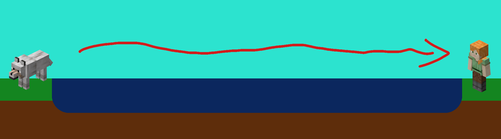

# Proper Pet TP

Have you ever been exploring, and found a cool dog, cat or parrot?
Have you ever continued exploring only to find that pet not following you anymore?
This mod fixes that! In vanilla, pets stop following you if they're outside of simulation distance.
This mod ensures they follow you around either way. You can't accidentally lose your pet anymore!

## What if my dog's sitting?
This mod won't change that. If your pet wouldn't normally teleport, due to being leashed or sitting,
it still won't! The exception is cross-dimensional teleportation,
currently your dog will teleport to you if you're in a different dimension.

## How?
Pets commonly get lost if they don't have any safe spot to teleport to.
This mod temporarily attaches the pet to your player data until you land in a safe spot.
This is a simple way to ensure that the pet can always keep following you. For the pet-owner,
it'll look as if the pet just smoothly teleported thousands of blocks.

In addition to minecraft's own checks for when a pet is too far away, this mod also ensures
that pets have a chance to teleport when chunks get suddenly unloaded. This handles cases
where the player suddenly teleports (through commands or enderpearls), or when the player dies.

## Does this work with modded pets?
Yeah, if they reuse Minecraft's code for tameable entities, it should be fine!
